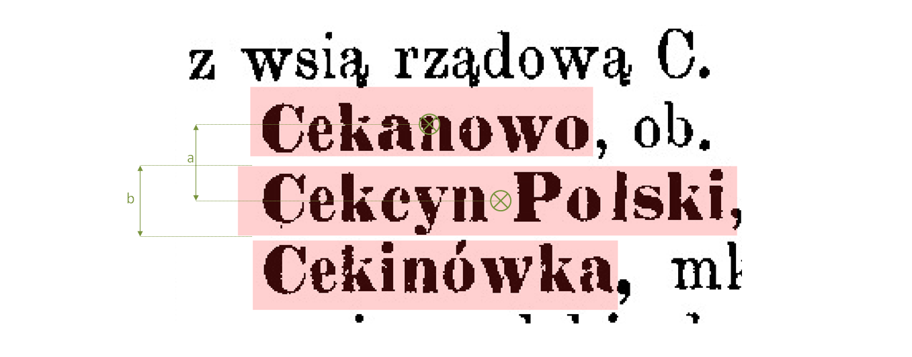

# PW_ABBREVIATIONS
 


This algorithm expands abbreviations from input features; if text is recognized as abbreviation, the algorithm replaces it by last previous word in the text (in reading order). Additionally it changes first letters in the words to capitals and the others to lower. If words in the text are sorted in alphabetical order, the algorithm can recognize words with first letter not matching to its neighborhood and change it to proper letter. 

PW_ABBREVIATIONS is dedicated especially for data from lexicons, dictionaries and encyclopaedias.
## Algorithm

### Reading order

The algorithm sets features in reading order at the beginning. Code implies that text is deployed in two columns dividing sheet in half.
You can change that by editing code below.

```Python
for sheet in SheetsOrderedList:
            if feedback.isCanceled(): break
            FirstColumnRect = self.TakeColumnRect(feedback,sheet)[0]
            SecondColumnRect = self.TakeColumnRect(feedback,sheet)[1]
            FeaturesInFirstColumn = self.index.intersects(FirstColumnRect)
            FeaturesInSecondColumn = self.index.intersects(SecondColumnRect)
```
```Python
def TakeColumnRect(self, feedback, sheet):
        """Returns two rectangles: first and second column"""
        bbox = sheet.geometry().boundingBox()
        x1, x2, x3, y1, y2 = bbox.xMinimum(), bbox.xMinimum() + (bbox.xMaximum() - bbox.xMinimum())/2, bbox.xMaximum(), bbox.yMinimum(), bbox.yMaximum()
        FirstColumnRect = QgsRectangle(QgsPointXY(x1,y2),QgsPointXY(x2,y1))
        SecondColumnRect = QgsRectangle(QgsPointXY(x2,y2),QgsPointXY(x3,y1))
```


The algorithm recognizes two features as lying in the same row of text if the differnce of y coordinates of both (<font color="green">a</font>) is less than half of feature height (<font color="green">b</font>).

```Python
if element.geometry().boundingBox().height()/2>(y_upper-element.geometry().centroid().asPoint().y()):
```


### Removing characters on edges

If features are already sorted in reading order the algorithm deletes unwanted characters at the beginning and the end of word.
User can choose characters from the predefined list.
```Python
CharsList = ['.',',',':',';','/','\\','"',"'",'|','_','*','!','^','~','+','@','#','$','&','(',')',' ','0','1','2','3','4','5','6','7','8','9','-']
```
```Cekcyn Polski,``` -> ```Cekcyn Polski```

```|Cekinówka``` -> ```Cekinówka```

### Expanding abbreviations

The algorithm recognizes abbreaviations (words shorter than 3 characters in this case) and replaces them by last word longer than 3 characters. Notice that words are sorted already in reading order.

```Python
self.if_short(string, 2)
```


```Cegielnia``` -> ```Cegielnia```

```C``` -> ```Cegielnia```

```C``` -> ```Cegielnia```

```C``` -> ```Cegielnia```

```C``` -> ```Cegielnia```

```C``` -> ```Cegielnia```

```C``` -> ```Cegielnia```

### Resolving first character

The algorithm analyses what letter is the most numerous in the neighbourhood of the word (entries lying before and after the word). After that script searches this letter in the group of capital letters at the beginning and cuts all previous letters.
If the script doesn't find the letter (this most popular in the neighbourhood), replaces all of capital letters from the beginning by this letter.
If the word doesn't start with the most popular letter in the neighbourhood and this is the lowercase, algorithm adds the most popular letter before the word. 
If the word starts with the most popular letter in the neighbourhood and this is the lowercase, algorithm does nothing.

```HCegielnia``` -> ```Cegielnia```

```cegielnia``` -> ```Cegielnia```

```egielnia``` -> ```Cegielnia```

```IEegielnia``` -> ```Cegielnia```

### Resolving capitalization

At the very end, the algorithm changes all of the first letters in the words to capital letters and changes all the other letters to lowercase.

```Cekcyn polski``` -> ```Cekcyn Polski```

```Czechowice-dziedzice``` -> ```Czechowice-Dziedzice```

```SkierNiewice``` -> ```Skierniewice```

## Parameters
<dd>
<b>Input abbreviations layer</b>
<dd>The features contain abbreviations to expand. </dd> 
<br><b>Input sheets layer</b>
<dd>The features with extands of sheets.</dd> 
<br><b>Text output field</b>
<dd>The field in the input table in which the expanded abbreviations will be add.</dd> 
<br><b>Characters to remove on edges</b>
<dd>If input text starts or ends with character from the list, this character will be remove from text.</dd> 
<br><b>Resolve first</b>
<dd>Changes first letters in the words to capitals and the others to lower letters.</dd> 
<br><b>Resolve capitalization</b>
<dd>Recognizes words with first letter not matching to its neighborhood and changes it to proper letter.
<br>(Alphabetical order of text words is necassery)</dd>
<br><b>Output layer</b>
<dd>Location of the output layer.</dd>
</dd>

## See also

PW_ABBREVIATIONS algorithm may process data obtained from these scripts:

[*PW_OCR*](https://github.com/OskarGraszka/PW_OCR)

[*PW_OCR_ADVANCED*](https://github.com/OskarGraszka/PW_OCR_ADVANCED)